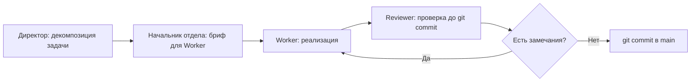

# Onboarding — M-OS / coordinata56

> **Версия:** 1.0
> **Дата:** 2026-04-18
> **Аудитория:** новые участники проекта — разработчики, дизайнеры, юристы, DevOps-инженеры.
> **Для конечных пользователей системы** (бухгалтеры, прорабы, менеджеры) — отдельный файл в разделе ниже.

Прочитайте этот документ за 30-60 минут. После прочтения вы поймёте, что строим, как устроен процесс и с чего начинать свою работу.

---

## Что это за проект

**M-OS (M Operating System)** — внутреннее программное обеспечение холдинга. Аналог корпоративной ERP (системы управления предприятием), построенный «с нуля» под конкретный холдинг, без покупки готовых платформ.

Один сотрудник — один аккаунт. Каждый видит только то, что положено по его роли и юридическому лицу. Владелец видит всё.

**cottage-platform-pod** — первый рабочий модуль M-OS. Посёлок «Координата 56»: 85 коттеджей бизнес-класса, 4 типа домов с опциями, полный цикл от проекта до сдачи. Этот модуль идёт в продуктивную работу первым — он пилот.

Холдинг включает 5 направлений: коттеджный девелопмент, МКД-девелопмент, 8 АЗС, металлообработка, карьер. Для каждого направления будет свой модуль (pod). Строим поочерёдно.

**Архитектура разработки.** Проект строят 17 специализированных AI-субагентов, организованных в иерархию: Координатор (Президент) → Директора → Начальники отделов → Исполнители. Вы присоединяетесь как живой участник — подрядчик в одном из отделов.

Подробное описание системы целиком: [`docs/m-os-vision.md`](m-os-vision.md)

---

## Для чего это строится

- Прозрачность: каждое действие (платёж, изменение статуса, создание договора) записывается в неизменяемый журнал с указанием кто, что, когда и на каком основании.
- Автоматизация: рутинные операции выполняет система, важные (платежи, подписания, согласования) — требуют явного одобрения человека.
- Контроль план/факт: бюджет, стадии строительства, закупки — всё сравнивается с планом в реальном времени.
- Масштабируемость: один аккаунт — несколько юридических лиц. «Бухгалтер АЗС» видит финансы АЗС и не видит коттеджи.

---

## Текущий статус (на 2026-04-18)

| Фаза | Что сделано | Статус |
|---|---|---|
| Фазы 0–3 cottage-platform | Backend: модели, API, тесты 200+, аудит, аутентификация, подрядчики/договоры/платежи/закупки | Закрыты |
| M-OS-0 Reframing | ADR 0008-0010, pod-архитектура, таксономия субагентов, переработка документации | Закрыт 2026-04-17 |
| M-OS-1 Foundation | Multi-company модель, fine-grained RBAC, Anti-Corruption Layer, Admin UI скелет | В работе |
| M-OS-1.1 Admin UI | Конструктор административного интерфейса, Design System Initiative | Волна 1, апрель 2026 |

Следующие фазы: M-OS-2 (интеграции с банками, 1С, ОФД), M-OS-3 (ИИ-инструменты), M-OS-4 (IoT и физический мир).

---

## Технологический стек (ADR 0002)

| Уровень | Технология | Версия |
|---|---|---|
| Язык backend | Python | 3.12 |
| Web-фреймворк | FastAPI | ≥ 0.111 |
| ORM | SQLAlchemy | 2.0 |
| Миграции БД | Alembic | ≥ 1.13 |
| База данных | PostgreSQL | 16 |
| Язык frontend | TypeScript | ≥ 5.5 |
| Frontend-фреймворк | React | 18 |
| Сборщик | Vite | ≥ 5.0 |
| UI-библиотека | shadcn/ui + Tailwind CSS v3 | актуальная |
| Управление данными (frontend) | TanStack Query v5 | актуальная |
| Контейнеризация | Docker + Docker Compose | актуальная |

Инфраструктура: один VPS, 81.31.244.71, 16 GB RAM. Среды: `dev` (локально) → `staging` → `production`. На текущем этапе — только `dev`.

Полное обоснование выбора каждой технологии с рассмотренными альтернативами: [`docs/adr/0002-tech-stack.md`](adr/0002-tech-stack.md)

---

## Структура репозитория

```
coordinata56/
├── backend/
│   ├── app/
│   │   ├── api/          — FastAPI-роутеры (endpoints)
│   │   ├── services/     — бизнес-логика
│   │   ├── models/       — SQLAlchemy-модели (таблицы)
│   │   ├── schemas/      — Pydantic-схемы (валидация и сериализация)
│   │   └── core/         — настройки, зависимости, безопасность
│   ├── alembic/versions/ — файлы миграций БД
│   └── tests/            — pytest, 200+ тестов
├── frontend/
│   └── src/
│       ├── admin/        — административный интерфейс
│       ├── field/        — интерфейс для прорабов и выездных сотрудников
│       ├── pages/        — страницы приложения
│       ├── providers/    — контексты и провайдеры состояния
│       ├── layouts/      — шаблоны страниц
│       ├── components/   — переиспользуемые компоненты
│       ├── lib/          — утилиты и хелперы
│       └── mocks/        — моковые данные для разработки
└── docs/
    ├── adr/              — архитектурные решения (14+ документов)
    ├── agents/           — регламенты субагентов и отделов
    ├── pods/cottage-platform/ — документы модуля коттеджей
    ├── design/           — Design System Initiative
    ├── legal/            — юридические черновики (6 документов)
    ├── governance/       — управление: changelog, аудиты, заявки
    ├── reviews/          — отчёты ревью кода и архитектуры
    ├── research/         — RFC и результаты исследований
    └── knowledge/        — решения, уроки, ретроспективы
```

---

## Процессы: как здесь всё работает

### Цепочка разработки

Каждый коммит проходит следующий путь:



**Reviewer выполняет проверку до `git commit`, а не после.** Это обязательное правило. Работает на `git diff --staged`. Источник: регламент v1.3 §1.

### Архитектурные решения (ADR)

Любое значимое техническое решение оформляется как ADR (Architecture Decision Record) в папке `docs/adr/`. ADR фиксирует: контекст → проблему → рассмотренные альтернативы → решение → последствия.

Отклоняться от принятых ADR без согласования нельзя. Если ADR неоднозначен или устарел — сначала пишется Amendment (поправка) и согласовывается с Координатором, затем меняется код.

Список всех ADR: [`docs/adr/`](adr/)

### CI-проверки

При каждом push и pull request автоматически запускаются:
- `lint-migrations` — проверка миграций Alembic на запрещённые операции (ADR 0013)
- `round-trip` — проверка `upgrade head → downgrade -1 → upgrade head`
- `pytest` — все тесты
- `ruff` — линтер Python-кода

Коммит не считается завершённым, если CI красный.

### Нормативная база

Проект управляется через иерархию документов:

1. `docs/CONSTITUTION.md` — основной закон, неприкосновенный
2. `docs/PROCEDURAL_CODE.md` — как выполняются процедуры
3. `docs/agents/CODE_OF_LAWS.md` — операционный кодекс
4. `docs/adr/` — архитектурные решения
5. `docs/agents/regulations/` — регламенты по уровням (coordinator / director / head / worker)
6. `docs/agents/departments/` — регламенты по направлениям

---

## Важнейшие правила проекта

**Никаких живых внешних интеграций до production-gate** (CODE_OF_LAWS ст. 45а). Банки, Росреестр, 1С, ОФД — только адаптеры-заглушки в коде. Живые вызовы запрещены до того, как юрист проверит legal-пакет и Владелец откроет production-gate. Исключение: Telegram — разрешён.

**Секреты не в коде.** Пароли, токены, ключи — только в `.env`, файл добавлен в `.gitignore`. В тестах — случайная генерация через `secrets.token_urlsafe(N)`, никаких литеральных строк.

**Четыре инженерных принципа** (правило Владельца):
1. Думать перед кодом — понять задачу до написания строчки
2. Сначала простота — самое простое решение, которое работает
3. Хирургические правки — минимальное изменение для достижения цели
4. Работать от цели — не от технического интереса

**git add -A запрещён** без предварительного просмотра `git status --short`. Стейджить только конкретные файлы по именам.

---

## Как начать работу

Общий порядок для любой роли:

1. `README.md` — быстрый старт, запуск локальной среды
2. `CLAUDE.md` (в корне проекта) — антипаттерник: ошибки, которые уже делали, и правила, которые выросли из них
3. [`docs/m-os-vision.md`](m-os-vision.md) — полная картина того, что строим
4. [`docs/adr/`](adr/) — принятые архитектурные решения (начните с ADR 0001–0005)
5. Регламент своего отдела (ссылки ниже)

### По направлениям

| Роль | Первый документ | Полный регламент отдела |
|---|---|---|
| Backend-разработчик | [`docs/knowledge/onboarding/developer-onboarding.md`](knowledge/onboarding/developer-onboarding.md) | [`docs/agents/departments/backend.md`](agents/departments/backend.md) |
| Frontend-разработчик | [`docs/knowledge/onboarding/developer-onboarding.md`](knowledge/onboarding/developer-onboarding.md) | [`docs/agents/departments/frontend.md`](agents/departments/frontend.md) |
| Дизайнер | [`docs/knowledge/onboarding/designer-onboarding.md`](knowledge/onboarding/designer-onboarding.md) | [`docs/agents/departments/design.md`](agents/departments/design.md) |
| Юрист | [`docs/knowledge/onboarding/legal-onboarding.md`](knowledge/onboarding/legal-onboarding.md) | [`docs/agents/departments/legal.md`](agents/departments/legal.md) |
| DevOps-инженер | [`docs/knowledge/onboarding/devops-onboarding.md`](knowledge/onboarding/devops-onboarding.md) | [`docs/agents/departments/infrastructure.md`](agents/departments/infrastructure.md) |

---

## Эскалации и контакты

- Вопросы по архитектуре и процессу — через соответствующего Директора вашего направления
- Блокирующие вопросы, не описанные в документах — через Координатора (Telegram, chat_id 5360165355)
- Юридические вопросы — через Telegram (штатного юриста пока нет, ищем)

Цепочка строгая: Worker → Начальник отдела → Директор → Координатор → Владелец. Перепрыгивать уровни нельзя.

---

## Живой статус проекта

- Dashboard с текущим состоянием субагентов: http://81.31.244.71:8765/
- История изменений — коммиты в ветке `main`
- Публичное зеркало документации: github.com/m-creator-holding/coordinata56-docs

---

## Для конечных пользователей системы

Если вы — бухгалтер, прораб или менеджер, которому выдали доступ в M-OS, ваш онбординг в другом месте. Этот файл — для участников команды разработки.

Онбординг для конечных пользователей: раздел «Для разработчиков» выше указывает на ссылки для пользователей системы — см. `user/` директорию в документации.

---

*Документ поддерживается tech-writer (L4 Advisory). При расхождении с кодом или ADR — сообщить Координатору.*
