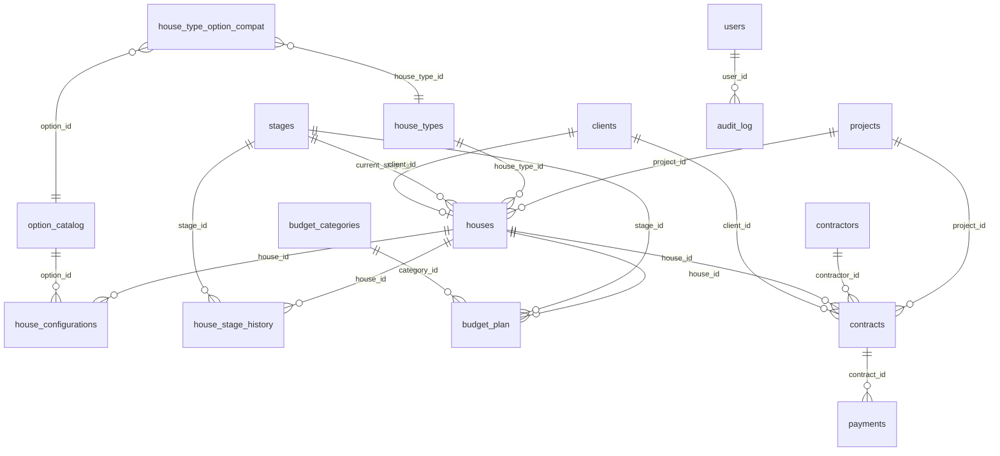

# ADR 0001 — Модель данных v1 (MVP)

- **Статус**: принято v1.1, редакция 2026-04-14
- **Дата первой редакции**: 2026-04-11
- **Дата текущей редакции**: 2026-04-14
- **Автор черновика**: Координатор (Claude Code)
- **Автор редакции v1.1**: Архитектор (Claude Code)
- **Утверждающий**: Владелец (Мартин)
- **Контекст фазы**: Phase 1, MVP для `coordinata56`

---

## Проблема

Проект «Координата 56» — 85 домов бизнес-класса в активном строительстве. Управление сейчас ведётся в разрозненных таблицах Excel и переписке в мессенджерах. Это порождает следующие конкретные боли:

1. **Нет единой картины состояния стройки.** Нельзя за 30 секунд ответить на вопрос «сколько домов сейчас на стадии кровли, какова сумма выплат по ним и есть ли просрочки по договорам?»
2. **Отсутствие план/факт на уровне дома.** Бюджет ведётся укрупнённо по проекту, отклонения не видны до финансовой отчётности.
3. **Нет истории изменений.** Кто и когда изменил статус дома, перенёс дату или откорректировал сумму — невозможно восстановить.
4. **Конфигуратор опций не автоматизирован.** Для 4 типов домов с опциями (навесы, спа, интерьерные пакеты и т.п.) выбор покупателя фиксируется вручную, цена пересчитывается вручную, ошибки неизбежны.
5. **Данные о покупателях не связаны с договорами.** Кто купил какой дом, какие оплаты прошли по договору — информация в разных местах.

Статус-кво неприемлем: при масштабировании на другие проекты холдинга (МКД, АЗС) ошибки будут стоить значительно дороже. Нужна единая реляционная схема как фундамент ERP.

---

## Контекст

Нужна реляционная модель для первой фазы MVP операционно-управленческой ERP коттеджного посёлка «Координата 56». Владелец сформулировал требование «контроль за каждым аспектом от фундамента до гвоздя», с максимальной детализацией план/факт на уровне каждого из 85 домов, 4 типовых проекта с опциями, вертикально-интегрированный цикл под ключ.

---

## Решение

Принимаем реляционную схему из 17 таблиц в PostgreSQL 16, описанную через SQLAlchemy 2.0 ORM. По сравнению с v1.0 добавлена таблица `clients` (покупатели).

### Список сущностей

**Справочники**
1. `stages` — 11 стадий стройки (земля → изыскания → фундамент → стены → кровля → инженерка → отделка → ландшафт → интерьер → сдача → сервис)
2. `budget_categories` — статьи расходов
3. `house_types` — 4 базовых типа дома
4. `option_catalog` — каталог опций конфигуратора (навесы, интерьерные пакеты, спа, сауна и т.п.)

**Связи справочников**
5. `house_type_option_compat` — совместимость опции с типом дома (many-to-many)

**Транзакционные сущности**
6. `projects` — проект (сейчас один — посёлок «Координата 56»)
7. `houses` — 85 домов, каждый привязан к проекту и типу, имеет текущую стадию
8. `house_configurations` — выбранные опции для конкретного дома (с фиксацией цены опции на момент выбора)
9. `house_stage_history` — история прохождения стадий для каждого дома
10. `budget_plan` — плановый бюджет (одна строка = один дом × одна стадия × одна статья расходов × плановая сумма; принадлежность к проекту определяется через `house_id → houses.project_id`)
11. `contractors` — справочник подрядчиков
12. `contracts` — договоры с подрядчиками
13. `payments` — исходящие платежи по договорам
14. `material_purchases` — журнал закупок материалов
15. `clients` — покупатели домов (физические и юридические лица)

**Сервисные**
16. `users` — пользователи системы с ролями
17. `audit_log` — журнал всех изменяющих действий

---

## ER-диаграмма связей

### Ключевые внешние ключи с кардинальностью

| От | К | Колонка FK | Кардинальность | ON DELETE |
|---|---|---|---|---|
| `houses` | `projects` | `project_id` | N:1 | RESTRICT |
| `houses` | `house_types` | `house_type_id` | N:1 | RESTRICT |
| `houses` | `stages` | `current_stage_id` | N:1 | RESTRICT |
| `houses` | `clients` | `client_id` | N:1 (nullable) | SET NULL |
| `house_configurations` | `houses` | `house_id` | N:1 | RESTRICT |
| `house_configurations` | `option_catalog` | `option_id` | N:1 | RESTRICT |
| `house_type_option_compat` | `house_types` | `house_type_id` | N:M pivot | RESTRICT |
| `house_type_option_compat` | `option_catalog` | `option_id` | N:M pivot | RESTRICT |
| `house_stage_history` | `houses` | `house_id` | N:M через историю | RESTRICT |
| `house_stage_history` | `stages` | `stage_id` | N:M через историю | RESTRICT |
| `budget_plan` | `houses` | `house_id` | N:1 | RESTRICT |
| `budget_plan` | `stages` | `stage_id` | N:1 | RESTRICT |
| `budget_plan` | `budget_categories` | `category_id` | N:1 | RESTRICT |
| `contracts` | `projects` | `project_id` | N:1 | RESTRICT |
| `contracts` | `contractors` | `contractor_id` | N:1 | RESTRICT |
| `contracts` | `houses` | `house_id` | N:1 (nullable) | SET NULL |
| `contracts` | `clients` | `client_id` | N:1 (nullable) | SET NULL |
| `payments` | `contracts` | `contract_id` | N:1 | RESTRICT |
| `audit_log` | `users` | `user_id` | N:1 | SET NULL |

---

## Ключевые технические решения

### 1. Первичные ключи
- **Тип**: `integer` с автоинкрементом (SQLAlchemy `Mapped[int] = mapped_column(primary_key=True, autoincrement=True)` — даёт `INTEGER` по умолчанию)
- **Причина**: проще для новичка в обучении, занимает 4 байта, хватит до 2.147·10⁹ записей, что с огромным запасом перекрывает ожидаемые объёмы (85 домов × платежи × материалы × 10 лет ~ 1-10 млн записей максимум). Использование BigInteger было бы избыточным
- **Если объём начнёт приближаться к лимиту Integer**: миграция `alembic` на BigInteger — контролируемая операция, в нашем случае отдалённая перспектива
- **UUID**: не используем в v1. Если позже понадобится публичный идентификатор для внешних систем — добавим отдельную колонку `public_id` с UUID
- **Примечание**: в этом разделе была правка — изначально заявлялся bigint, по факту использован integer. Зафиксировано в `docs/knowledge/lessons.md` L1.2

### 2. Денежные поля
- **Тип**: `bigint`, хранится в копейках (`amount_cents`)
- **Причина**: floating-point для денег — это классическая ошибка с реальными последствиями. Хранение в копейках снимает проблему округлений. Конвертация в рубли — на слое представления
- **Конвенция именования**: суффикс `_cents` обязателен для всех денежных колонок
- **`house_configurations.price_cents`**: хранит цену конкретной опции, денормализованно скопированную из `option_catalog.price_cents` **на момент выбора покупателем**. Это намеренная денормализация: если каталожная цена позже изменится, зафиксированная цена конфигурации остаётся исторически корректной. Семантика: «цена одной единицы опции на момент подтверждения конфигурации дома», не суммарная.

### 3. Временные метки
- **Стандарт**: на всех транзакционных таблицах — `created_at` и `updated_at` типа `TIMESTAMPTZ` с default `now()`
- **Временная зона**: всё в UTC на уровне БД, UI-конвертация в MSK/пользовательскую TZ
- **Обновление `updated_at`**: через SQLAlchemy `onupdate=func.now()`

### 4. Мягкое удаление
- **Где применяем**: на критических бизнес-сущностях (`projects`, `houses`, `contractors`, `contracts`, `users`, `clients`) — добавляем nullable колонку `deleted_at TIMESTAMPTZ`
- **Где не применяем**: на справочниках (`stages`, `budget_categories`, `house_types`, `option_catalog`) — удаление справочника требует явного согласия и затрагивает все ссылки. На аудит-логе и истории — никогда
- **Причина**: данные священны, особенно в финансовом контуре. Физическое удаление — только после явного разрешения Владельца
- **Митигация риска «забытого фильтра»**: глобальный фильтр `deleted_at IS NULL` реализуется через SQLAlchemy 2.0 `with_loader_criteria` на уровне базового класса модели. Все сущности с `deleted_at` наследуются от `SoftDeleteMixin`, который регистрирует критерий автоматически. Разработчик не может случайно получить «удалённые» записи через ORM-запрос без явного `include_deleted=True`. Описание механизма — в будущем `ADR-0003 (Layered Architecture & Audit)`.

### 5. Внешние ключи
- **Стандарт `ON DELETE`**: `RESTRICT` по умолчанию — не позволять каскадно ломать связанные данные
- **Исключения**: `audit_log.user_id` → `SET NULL` (пользователя можно удалить, лог остаётся анонимизированным); `houses.client_id`, `contracts.client_id` → `SET NULL` (расторжение договора не уничтожает финансовую историю)
- **Индексация**: каждый FK получает индекс автоматически (через явное `index=True`)

### 6. Типы перечислений (enums)
- **Метод**: Python `enum.Enum` → SQLAlchemy `Enum` column type с именем типа в БД
- **Где используется**:
  - `users.role`: `owner | accountant | construction_manager | read_only`
  - `option_catalog.category`: `canopy | interior | wellness | landscape | utility | other`
  - `contracts.status`: `draft | active | completed | cancelled`
  - `audit_log.action`: `create | update | delete | login | logout | access_denied`

### 7. JSONB поля
- **Где используется**: `contractors.contacts_json` (телефоны, email, адрес), `audit_log.changes_json` (старые/новые значения поля)
- **Причина**: гибкость для неструктурированных данных, которые не оправдывают отдельных таблиц на первой фазе. PostgreSQL JSONB — индексируемый и быстрый
- **Ограничение**: не пихать в JSONB то, что нужно для поиска/фильтрации в списках — это должно быть реляционными колонками

### 8. Соглашение об именовании
- **Таблицы**: `snake_case`, множественное число (`houses`, не `house`)
- **Колонки**: `snake_case`
- **Первичный ключ**: всегда `id`
- **Внешние ключи**: `<singular_referenced_table>_id` (например, `house_id`, `stage_id`)
- **Временные метки**: `created_at`, `updated_at`, `deleted_at`
- **Индексы**: `ix_<table>_<columns>`
- **Уникальные индексы**: `uq_<table>_<columns>`
- **Внешние ключи (имя constraint)**: `fk_<table>_<column>_<referenced_table>`
- **Check-констрейнты**: `ck_<table>_<description>`
- **Primary key (имя)**: `pk_<table>`

Реализовано через `naming_convention` в SQLAlchemy `MetaData`.

### 9. Индексная стратегия
- Индекс на каждом FK (автоматически)
- Индекс на `created_at` для таблиц, по которым будут запросы с диапазоном дат
- Уникальные индексы на естественных ключах: `users.email`, `contractors.inn`, `projects.code`, `house_types.code`, `option_catalog.code`, `stages.code`, `budget_categories.code`
- Индекс на `houses.project_id, plot_number` (составной), потому что номер участка уникален в рамках проекта
- Индекс на `audit_log.entity_type, entity_id, timestamp` для быстрого восстановления истории объекта
- Индекс на `clients.inn` (уникальный, partial: `WHERE inn IS NOT NULL`) — физические лица могут не иметь ИНН в системе

### 10. Роли пользователей (MVP)
- **owner** — Мартин, видит и меняет всё
- **accountant** — платежи и бухгалтерия
- **construction_manager** — стройка, материалы, подрядчики
- **read_only** — только чтение (инвесторы, аудиторы)

### 11. Таблица `clients` (покупатели)

Принято включить в MVP1 по следующим причинам:
- Бизнес-класс, 85 домов: реальные покупатели появляются ещё на стадии котлована, договор с покупателем — это уже финансовый документ.
- Без `clients` таблица `contracts` теряет смысл: с кем заключён договор на продажу?
- Объём минимален — достаточно 8 колонок, сложной логики не добавляет.

**Минимальная схема `clients`:**

| Колонка | Тип | Ограничения | Описание |
|---|---|---|---|
| `id` | integer | PK, autoincrement | — |
| `full_name` | text | not null | ФИО или наименование организации |
| `inn` | varchar(12) | nullable, unique | ИНН (12 цифр — физлицо, 10 — юрлицо) |
| `phone` | varchar(20) | nullable | Основной телефон |
| `email` | varchar(255) | nullable | Email |
| `is_legal_entity` | boolean | not null, default false | Физлицо / юрлицо |
| `created_at` | timestamptz | not null, default now() | — |
| `deleted_at` | timestamptz | nullable | Мягкое удаление |

Связи:
- `houses.client_id → clients.id` (nullable, SET NULL) — один покупатель может купить один дом (в рамках MVP; при необходимости расширяется)
- `contracts.client_id → clients.id` (nullable, SET NULL) — договор продажи привязан к покупателю

Полноценный CRM-модуль (история контактов, воронка, документооборот) — в `ADR-0004` (Фаза 5, продажи).

### 12. Аутентификация и хранение паролей

**Хранение паролей в таблице `users`:**

| Колонка | Тип | Ограничения | Описание |
|---|---|---|---|
| `password_hash` | text | not null | Хеш пароля в формате PHC (argon2id) |

- **Алгоритм**: `argon2id` — актуальный стандарт, победитель Password Hashing Competition 2015, рекомендован OWASP (в отличие от bcrypt, устойчив как к GPU-атакам, так и к side-channel). Python-библиотека: `argon2-cffi`.
- **Соль**: автогенерируется библиотекой при каждом хешировании, хранится внутри строки PHC (`$argon2id$v=19$m=65536,t=3,p=4$<salt>$<hash>`). Разработчик не управляет солью вручную.
- **Параметры по умолчанию** `argon2-cffi`: memory=65536 KiB, iterations=3, parallelism=4 — соответствуют рекомендациям OWASP 2024.
- **Верификация**: `argon2.verify(stored_hash, plain_password)` — библиотека извлекает параметры и соль из строки автоматически.
- **Детальное описание** политик паролей, ротации токенов и OAuth2 — в будущем `ADR-0005 (Безопасность & Аутентификация)`.

**JWT и библиотека токенов:**

Отказываемся от `python-jose` (заброшена с 2022, имеет CVE) в пользу `PyJWT` (активно поддерживается, последний релиз 2024, рекомендация OWASP). Это решение зафиксировано в `ADR-0002` как обновление стека; данный ADR фиксирует факт для согласованности модели данных (поля `users`: токены не хранятся в БД, refresh-токены — в отдельной таблице `refresh_tokens` в рамках ADR-0005).

---

## Рассмотренные альтернативы

### A. UUID как первичные ключи
- **Плюсы**: не раскрывают порядок вставки, можно генерировать на клиенте
- **Минусы**: 16 байт вместо 8, сложнее читать человеку, тормозит индексы в некоторых сценариях
- **Почему отклонено**: Мартин — новичок, нужен максимально простой и привычный тип. Если позже понадобится UUID для API — добавим как вторую колонку

### B. NUMERIC для денег
- **Плюсы**: точное представление десятичных дробей, поддержка Python `Decimal`
- **Минусы**: медленнее bigint, больше места, для копеек смысла нет (валюта рубль, копейки — наименьшая единица)
- **Почему отклонено**: `bigint` в копейках — стандарт Stripe, Wise, Revolut и всех серьёзных финтехов. Простой и надёжный

### C. Жёсткое удаление с полной историей через триггеры
- **Плюсы**: «чистый» stated data в основных таблицах
- **Минусы**: сложность поддержки триггеров, триггеры могут быть обойдены через миграции, отладка сложнее
- **Почему отклонено**: `deleted_at` + фильтр в ORM проще и прозрачнее. Если понадобится реальный audit trail — он у нас есть в `audit_log`

### D. Одна огромная таблица транзакций (EAV или поли-таблица)
- **Плюсы**: гибкость добавления новых типов без миграций
- **Минусы**: кошмар в запросах, отсутствие типизации, невозможность референциальной целостности
- **Почему отклонено**: у нас чётко определённые сущности, нет причин терять реляционную модель

### E. bcrypt вместо argon2id для хранения паролей
- **Плюсы**: зрелая библиотека, широко известен, passlib поддерживает
- **Минусы**: ограничен 72 байтами входа, не оптимизирован против GPU-атак (нет memory-hardness), OWASP 2024 рекомендует argon2id при возможности выбора
- **Почему отклонено**: `argon2-cffi` не сложнее в использовании, argon2id — лучший выбор для новых систем без легаси-ограничений

### F. Вынести `clients` в Фазу 5 (out-of-scope MVP1)
- **Плюсы**: меньше таблиц в начале, быстрее запуск Фазы 1
- **Минусы**: таблица `contracts` без клиента лишается смысла для договоров продажи; при добавлении позже — миграция `ALTER TABLE contracts ADD COLUMN client_id` с пустыми значениями по всем существующим строкам; бизнес-класс подразумевает ранние брони с договорами
- **Почему отклонено**: `clients` достаточно проста (8 колонок) и необходима для целостности модели уже в Фазе 1

---

## Последствия

**Положительные:**
- Чёткая, предсказуемая модель, понятная новичку
- Полное соответствие SQL-стандартам, портируемо между PostgreSQL-версиями
- Аудит и мягкое удаление — фундамент прозрачности, который требовал Владелец
- Готовность к добавлению ML/аналитики поверх в фазах M2+
- Покупатель связан с домом и договором уже в MVP1 — нет «болтающихся» контрактов

**Отрицательные:**
- 17 таблиц — уже не «тривиальная схема», требует дисциплины при внесении изменений
- Мягкое удаление требует фильтрации — решено через `with_loader_criteria` (см. п. 4 выше)
- JSONB-поля без схемы — риск расхождения форматов, надо будет валидировать на слое приложения

**Риски (отмечаем, решаем в следующих фазах):**
- Партиционирование `audit_log` по времени — понадобится при росте до миллионов строк, пока не делаем
- Full-text search по номерам договоров, именам подрядчиков — позже через `pg_trgm` или GIN-индексы
- Многоязычность имён — пока всё на русском, если понадобится английский — добавим `name_en`
- `clients`: при появлении CRM-требований (история касаний, воронка, связанные документы) — таблица расширяется миграцией без ломки существующей структуры

---

## Файлы, создаваемые по этому ADR
- `backend/app/db/base.py` — Base класс + `naming_convention` + `SoftDeleteMixin`
- `backend/app/db/session.py` — engine + sessionmaker
- `backend/app/core/config.py` — настройки через pydantic-settings
- `backend/app/models/*.py` — модели по доменам
- `backend/alembic.ini`, `backend/alembic/env.py` — конфигурация миграций
- `backend/alembic/versions/xxxx_initial_schema.py` — первая миграция
- `backend/app/db/seeds.py` — скрипт наполнения справочников

---

## Changelog

### v1.1 — 2026-04-14 (редакция по итогам ревью reviewer)

**Major-замечания (устранены):**
1. Добавлена секция **«Проблема»** — отдельно, до «Контекста». Описаны 5 конкретных болей, объясняющих, почему статус-кво неприемлем.
2. Добавлена **ER-диаграмма** в формате Mermaid и таблица ключевых FK с кардинальностью и политикой ON DELETE.
3. Добавлена **стратегия хранения паролей**: колонка `password_hash text not null`, алгоритм `argon2id` через `argon2-cffi`, автогенерация соли. Зафиксирован отказ от `python-jose` в пользу `PyJWT`.
4. Добавлена таблица **`clients`** (17-я таблица схемы) с 8 колонками и связями `houses.client_id` и `contracts.client_id`. Обоснование включения в MVP1 задокументировано; альтернатива «вынести в Фазу 5» разобрана и отклонена.

**Minor-замечания (устранены):**
5. Зафиксирована **митигация soft-delete**: `SoftDeleteMixin` + SQLAlchemy `with_loader_criteria`, детали в будущем ADR-0003.
6. Уточнена **семантика `house_configurations.price_cents`**: цена одной единицы опции, денормализованно зафиксированная на момент подтверждения конфигурации.
7. Уточнена **гранулярность `budget_plan`**: одна строка = дом × стадия × статья расходов × плановая сумма.

**Что не изменилось:**
- PK остаются `integer` (фундаментальное решение, не оспорено ревью).
- Базовые 16 таблиц (кроме добавленной `clients`) — без структурных изменений.
