# Визуальные схемы системы субагентов M-OS

**Версия:** 1.1
**Дата:** 2026-04-17
**Источник данных:** `agents-map.yaml`

> **Примечание v1.1:** С введением ADR 0010 (таксономия) каждый агент имеет тип: `executive`, `core_department`, `domain_pod`, `governance`, `advisory`. Поле `agent_type` добавлено в `agents-map.yaml`. Полная перерисовка диаграмм под pod-структуру -- в следующем обновлении.

Все схемы — в нотации Mermaid. Рендерятся в GitHub Markdown, VS Code Mermaid extension, mermaid.live.

**Как читать:**
- Сплошная стрелка `-->` — подчинение (делегирование сверху вниз)
- Пунктирная стрелка `-.->` — консультация / информационный поток (советники, ревью)
- Прямоугольник — активный агент
- Пунктирный прямоугольник — dormant (файл есть, но задачи не получает до активации направления)

---

## А. Общая оргструктура (по уровням)

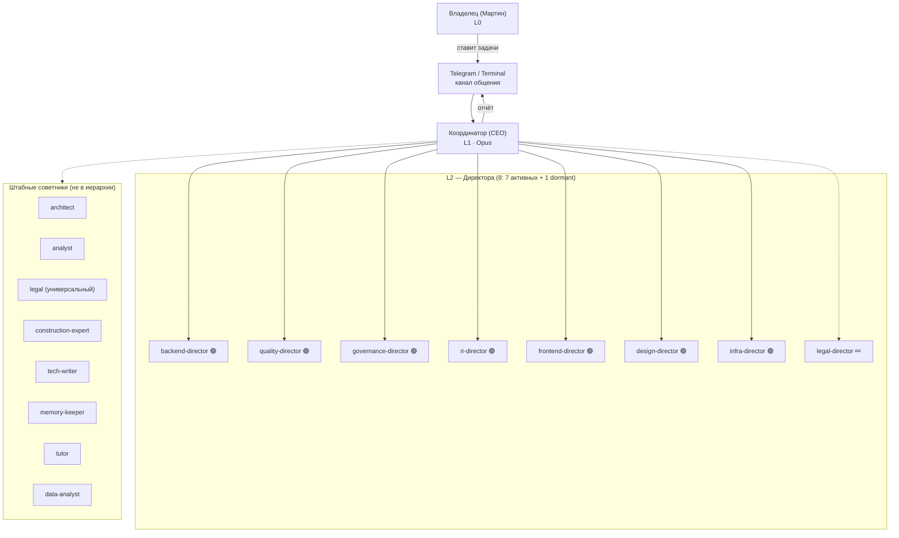

**Комментарий:** 7 активных директоров реально получают задачи (backend, quality, governance, ri, frontend, design, infra); 1 dormant (legal-director) — файл создан, задачи получает только при боевых данных. Активация frontend/design/infra — 2026-04-16 msg 665+695.

---

## Б. Структура по департаментам (для читаемости — 4 схемы)

### Б.1 Бэкенд и Инфраструктура (активно)

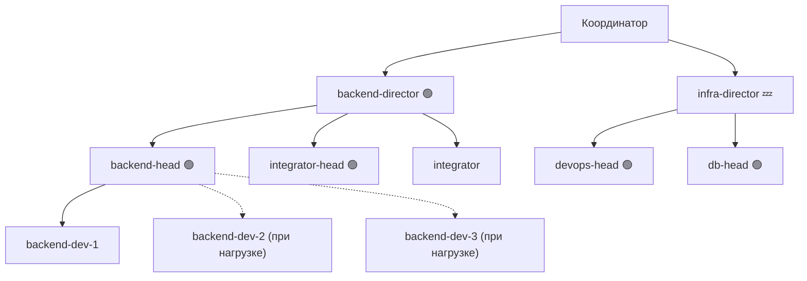

### Б.2 Качество (активно полностью)

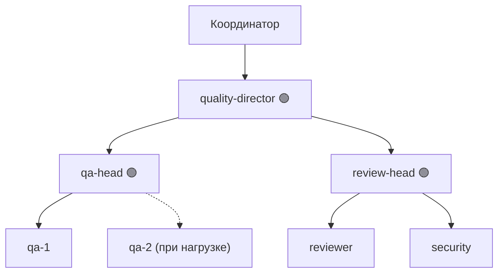

### Б.3 Governance и R&I (особые, активны с 2026-04-15)

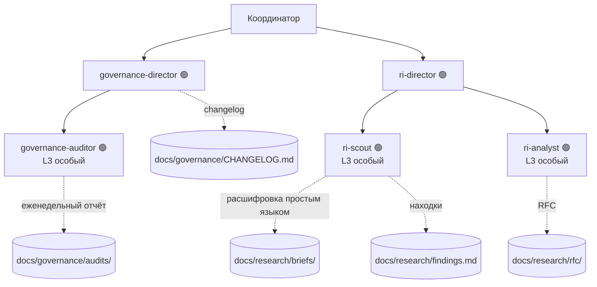

### Б.4 Фронтенд и Дизайн (dormant, активация Фаза 4)

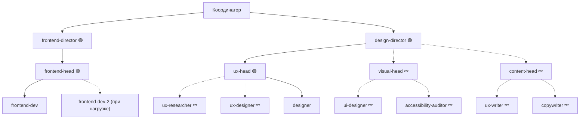

### Б.5 Юридическое направление (dormant, активация при боевых данных)

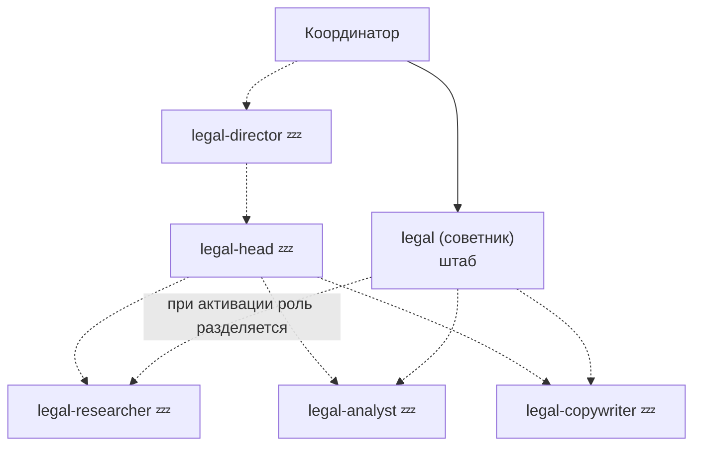

---

## В. Маршрут типовой задачи от входа до отчёта

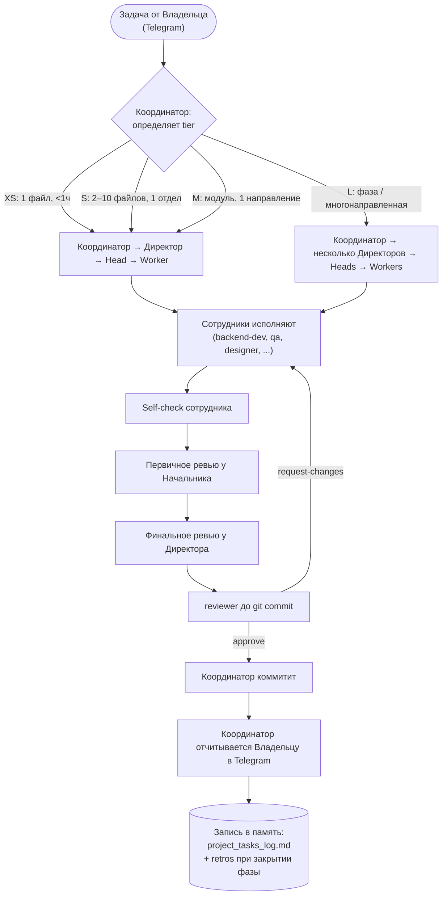

---

## Г. Схема делегирования (кто кому может)

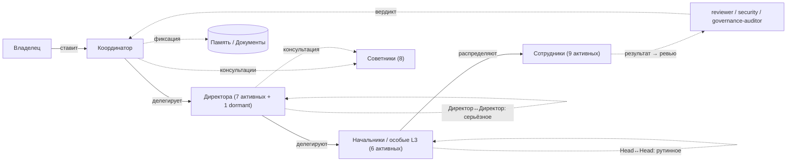

**Правило кросс-вертикали (v1.4 §7.1):**
- Начальники разных направлений общаются между собой — можно (рутина)
- Директора разных направлений общаются — можно (серьёзное)
- Сотрудники разных направлений напрямую — **запрещено всегда**

---

## Д. Жизненный цикл задачи (статусы)

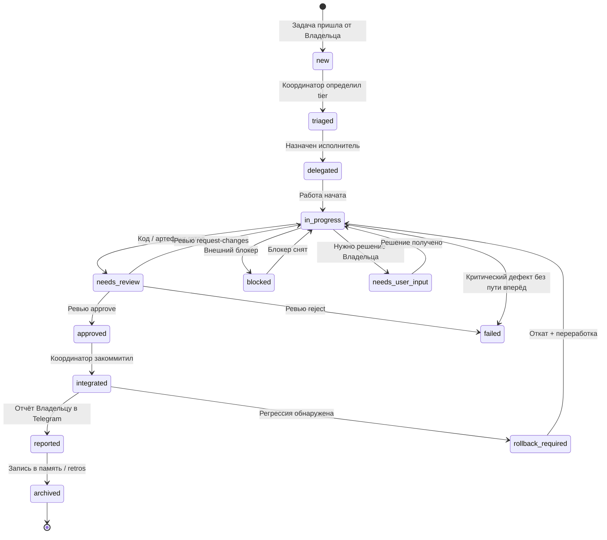

**Комментарий к статусам:**
- `new / triaged / delegated` — в руках Координатора (классификация и назначение).
- `in_progress` — у исполнителя (Worker / Head).
- `needs_review` — у reviewer/security/Head/Директора — зависит от уровня задачи.
- `approved` — готово к коммиту.
- `integrated` — закоммичено, но ещё не отчитались Владельцу.
- `reported` — Владелец в курсе через Telegram.
- `archived` — записано в `project_tasks_log.md` (всегда) и в ретроспективу фазы (при закрытии фазы).

**Специальные состояния:**
- `blocked` — ждём внешнего (ответ от API, запуск сервиса, решение подрядчика).
- `needs_user_input` — нужно бизнес-решение Владельца, работа стоит.
- `failed` — критический дефект, работа невозможна в текущем подходе → эскалация Координатору, возможен `architect`-ревью для смены подхода.
- `rollback_required` — после `integrated` обнаружена регрессия в другой фиче → откат через git + переработка.

---

## Е. Как Governance и R&I встроены в поток

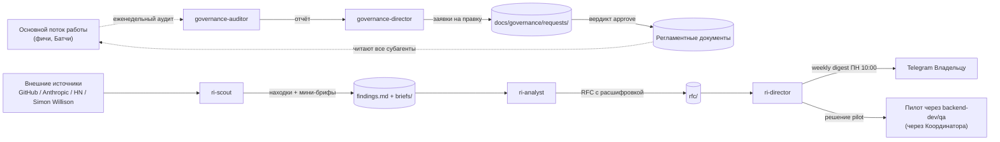

**Ключевые артефакты цикла:**
- Governance: `docs/governance/audits/weekly/YYYY-MM-DD-*.md`, `docs/governance/requests/`, `docs/governance/CHANGELOG.md`
- R&I: `docs/research/findings.md`, `docs/research/briefs/<slug>.md`, `docs/research/rfc/rfc-NNN-*.md`

---

## Как обновлять схемы

1. **При создании нового агента** — добавить узел в соответствующую схему (оргструктура + департаментская).
2. **При активации dormant-агента** — заменить `💤` на `🟢`, убрать пунктирные стрелки.
3. **При изменении правил делегирования** — обновлять схему Г + соответствующий регламент через комиссию Governance.
4. **Проверка валидности** — `mermaid-cli` или `mermaid.live` перед коммитом.

---

# ДОБАВЛЕНИЕ 2026-04-16: схемы по v1.6 «Координатор-транспорт»

Три новых схемы, отражающих архитектуру «логическая иерархия + центральный оркестратор», по прямому указанию Владельца (Telegram msg 754). Источник данных связей — `delegation-rules.yaml`, источник схемы событий — `task-event-log.schema.yaml`.

## Ж. Логическая оргструктура (как Вы это видите)

На этой схеме видно **кто кому подчиняется логически**, как если бы субагенты могли физически делегировать друг другу. Это ментальная модель для Владельца и команды — ответственность, подчинение, ревью.

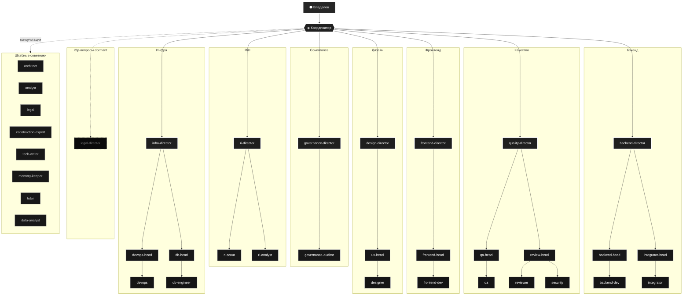

Эта схема является логической проекцией: она показывает цепочку ответственности (`ri-director → ri-scout`), а не runtime-вызовы. Технически все вызовы проходят через Координатора-транспорт (см. следующую схему З). Для понимания команды и ответственности — логическая проекция корректна.

## З. Фактический runtime-flow (что происходит под капотом)

А так выглядит архитектура, как её видит платформа Claude Code: **все стрелки-запуски идут от одного центра — main-orchestrator (Координатор)**. Директора и Начальники — это субагенты, они не запускают других субагентов, они только возвращают `delegation_requested` событие, которое читает оркестратор.

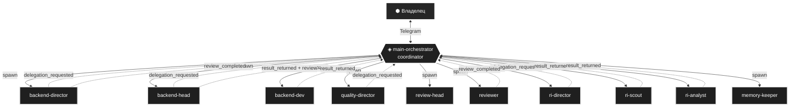

**Сплошные стрелки** — Координатор **запускает** субагента (тул-вызов `Agent(subagent_type=X)`).
**Пунктирные стрелки** — субагент **возвращает** событие (delegation_requested / result_returned / review_completed) в контекст Координатора.

Технически вся система — звезда с центром в Координаторе. Иерархия — на уровне данных (`requested_by` в каждом событии), не на уровне физических вызовов.

## И. Пример прохождения задачи (end-to-end)

Задача: Владелец в Telegram прислал «добавить Contract CRUD в бэкенд». Вот полная цепочка событий для tier=M задачи, в формате таймлайна:

```mermaid
flowchart TB
    classDef step fill:#1f1f1f,stroke:#ffffff,color:#ffffff
    classDef agent fill:#151515,stroke:#dddddd,color:#ffffff
    classDef artifact fill:#0a1a2a,stroke:#7c9fff,color:#dbeafe
    classDef memory fill:#2a1a4a,stroke:#a78bfa,color:#ede9fe

    T0(("⬢ Владелец в Telegram:<br/><i>добавить Contract CRUD</i>")):::step
    E1[task_created · source=telegram<br/>tier=M · direction=backend]:::step
    T0 --> E1

    E1 --> S1[COORD → backend-director:<br/>напиши бриф для backend-head]:::agent
    S1 --> E2[delegation_requested<br/>requested_by=coord → target=backend-director]:::step
    E2 --> E3[agent_spawned<br/>spawned_by=coord · target=backend-director]:::step
    E3 --> R1[backend-director возвращает бриф<br/>для backend-head + FILES_ALLOWED]:::agent
    R1 --> E4[result_returned<br/>from=backend-director · to=coord]:::step

    E4 --> S2[COORD → backend-head:<br/>дословный бриф Директора]:::agent
    S2 --> E5[delegation_requested<br/>requested_by=backend-director → target=backend-head]:::step
    E5 --> E6[agent_spawned<br/>spawned_by=coord · target=backend-head]:::step
    E6 --> R2[backend-head возвращает план распределения<br/>3 подзадачи для backend-dev]:::agent
    R2 --> E7[result_returned<br/>from=backend-head]:::step

    E7 --> S3[COORD → backend-dev ×3 параллельно:<br/>3 подзадачи с FILES_ALLOWED]:::agent
    S3 --> E8[3× agent_spawned<br/>target=backend-dev]:::step
    E8 --> R3[3 результата:<br/>code + tests + miграция]:::agent
    R3 --> E9[3× result_returned]:::step

    E9 --> S4[COORD → backend-head:<br/>первичное ревью]:::agent
    S4 --> E10[review_requested → backend-head]:::step
    E10 --> R4[backend-head: approve]:::agent
    R4 --> E11[review_completed<br/>reviewer=backend-head · approve]:::step

    E11 --> S5[COORD → backend-director:<br/>финальная приёмка]:::agent
    S5 --> E12[review_requested → backend-director]:::step
    E12 --> R5[backend-director: approve]:::agent
    R5 --> E13[review_completed<br/>reviewer=backend-director · approve]:::step

    E13 --> S6[COORD → reviewer:<br/>pre-commit на git diff --staged]:::agent
    S6 --> E14[review_requested → reviewer]:::step
    E14 --> R6[reviewer: approve]:::agent
    R6 --> E15[review_completed<br/>reviewer=reviewer · approve]:::step

    E15 --> C1[COORD: git commit + push]:::artifact
    C1 --> E16[memory_written<br/>project_tasks_log.md update]:::memory
    E16 --> E17[user_reported<br/>Telegram msg → Владельцу:<br/>Contract CRUD готов · commit &#60;sha&#62;]:::step
```

Всего на одну M-задачу — **17 событий**, **6 тул-вызовов Agent** (S1-S6), **5 ревью-точек** (Head → Director → reviewer), и только ОДИН коммит (C1) в финале. На дашборде Вы видите всё это живьём: по ленте проходят 17 событий, на схеме подсвечивается цепочка Координатор → Директор → Head → Workers, вспыхивает зелёным при approve.

## Как пользоваться схемами Ж-И

- **Схема Ж** — для обсуждения команды, ответственности, планирования. «Кто за это отвечает» → смотри reports_to.
- **Схема З** — для отладки платформенных ограничений. «Почему бот висит» → смотри runtime-flow.
- **Схема И** — как шаблон для task-routing-template.md. Новую задачу раскладываете по тем же стадиям.
