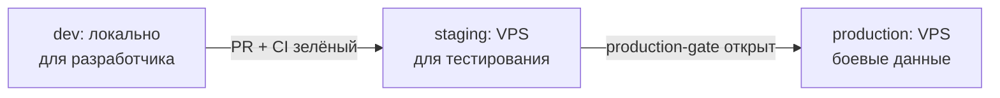

# Онбординг DevOps-инженера — M-OS / coordinata56

> **Для кого:** DevOps-инженеры и системные администраторы, приходящие в проект.
> **Время чтения:** 30–40 минут.
> **Дата:** 2026-04-18

После прочтения вы поймёте текущую инфраструктуру, правила работы с окружениями и что планируется в части CI/CD.

---

## Текущая инфраструктура

Один VPS. Параметры:

| Параметр | Значение |
|---|---|
| IP | 81.31.244.71 |
| RAM | 16 GB |
| ОС | Linux (актуальная стабильная) |
| Оркестрация | Docker + Docker Compose |
| Среды | dev (локально), staging (готовится), production (не открыт) |

Все сервисы запускаются через `docker compose up`. Нет Kubernetes. Нет managed-сервисов в облаке. Self-hosted — принцип проекта.

### Текущие сервисы в docker-compose.yml

- `backend` — FastAPI (Python 3.12)
- `db` — PostgreSQL 16
- `frontend` — Vite dev server (в production — nginx со статикой)

Переменные окружения — в `.env` файлах, добавлены в `.gitignore`. Никогда не коммитить.

---

## Принципы, обязательные к исполнению

**Никаких боевых данных без явного согласования Владельца.** Production-операции (`docker compose down`, миграции prod, перезапуск сервисов) — только с явного письменного разрешения.

**Секреты не в коде и не в git.** Любой файл с ключами, паролями, токенами — строго в `.env` и в `.gitignore`. Если случайно закоммитили — немедленно ротация ключей.

**Никаких живых внешних интеграций до production-gate.** Банки, Росреестр, 1С, ОФД — только заглушки. Живые HTTP-вызовы к внешним API запрещены до того, как юрист подпишет legal-пакет и Владелец откроет production-gate. Исключение: Telegram — разрешён.

Источник: CODE_OF_LAWS ст. 45а. Полный текст: [`docs/agents/CODE_OF_LAWS.md`](../../agents/CODE_OF_LAWS.md)

---

## CI/CD

### Текущий статус

CI настроен через GitHub Actions (`.github/workflows/ci.yml`). Запускается на `push` и `pull_request` в `main`.

### Обязательные gates

| Job | Что проверяет | При провале |
|---|---|---|
| `lint-migrations` | Запрещённые операции в Alembic-миграциях (ADR 0013) | Блокирует merge |
| `round-trip` | `upgrade head → downgrade -1 → upgrade head` без ошибок | Блокирует merge |
| `pytest` | Все тесты backend, покрытие ≥ 85% | Блокирует merge |
| `ruff` | Линтер Python-кода, 0 ошибок | Блокирует merge |

### Что запрещено в миграциях (lint-migrations)

CI-линтер проверяет файлы в `backend/alembic/versions/` и блокирует следующие операции:

- `op.drop_column(...)` — без expand/contract паттерна
- `op.alter_column(..., new_column_name=...)` — прямое переименование
- `op.alter_column(..., nullable=False)` — без `server_default` или предварительного backfill
- `op.drop_table(...)` — без промежуточного переименования в `_deprecated_`

Если операция легитимна — нужен комментарий `# migration-exception: <rule> — <обоснование>` прямо перед строкой.

Локальный прогон линтера: `cd backend && python -m tools.lint_migrations alembic/versions/`

Полные правила: [`docs/adr/0013-migrations-evolution-contract.md`](../../adr/0013-migrations-evolution-contract.md)

---

## Egress: управление исходящим трафиком

До production-gate действует запрет на исходящие соединения к внешним API (банки, Росреестр, 1С и т.д.). Реализуется через iptables-правила на уровне хоста:

- Разрешены: исходящий трафик на Telegram API (api.telegram.org, 443)
- Разрешены: служебный трафик (DNS 53, NTP 123, apt-репозитории)
- Блокированы: все прочие исходящие соединения к нероссийским и внешним API

При добавлении нового разрешения в egress — согласовать с Координатором и зафиксировать в задаче на infra-director.

---

## Резервное копирование

Текущее состояние: PostgreSQL backup скриптами через pg_dump, расписание — ежедневно.

Требования по проекту (из `docs/m-os-vision.md`, блок Е):
- Point-in-time recovery (PITR) — восстановление на любую точку во времени, снимок каждые 5 минут
- DR drills — ежеквартальные учения: искусственно ломаем и восстанавливаем
- Бэкапы с шифрованием

Задача настройки PITR и шифрования бэкапов — в scope M-OS-1.

---

## Среды и правила работы с ними

| Среда | Данные | Кто может деплоить |
|---|---|---|
| dev | Тестовые, генерируемые seed-скриптами | Любой разработчик |
| staging | Анонимизированные копии или синтетические | DevOps по заявке |
| production | Реальные данные холдинга | Только после production-gate |

Production-gate ещё не открыт. Дата зависит от подписания legal-пакета юристом.

---

## Live-dashboard субагентов

Для мониторинга состояния AI-субагентов проекта работает dashboard:

http://81.31.244.71:8765/

Python-сервер + Mermaid-диаграммы + webhook-интеграция. Поддерживается командой проекта. Если перестал работать — сообщить Координатору.

---

## Telegram-уведомления

Система M-OS использует Telegram для уведомлений сотрудникам. Это единственная разрешённая живая внешняя интеграция.

Telegram-бот подключён через Bot API (api.telegram.org). Токен бота хранится в `.env`. При настройке нового окружения — получить токен у Координатора, не генерировать новый бот самостоятельно.

---

## Регламент отдела инфраструктуры

Полный регламент: [`docs/agents/departments/infrastructure.md`](../../agents/departments/infrastructure.md)

Статус отдела: частично активен (db-engineer и devops уже работают). Полная активация — при старте Фазы 9 (деплой на production).

---

## Куда эскалировать

- Архитектурные вопросы по инфре — infra-director
- Вопросы по CI/CD и тестам — quality-director
- Production-операции — только через Координатора с подтверждением Владельца
- Инциденты в нерабочее время — Telegram (контакт предоставит Владелец)

---

## Полезные ссылки

- Регламент отдела: [`docs/agents/departments/infrastructure.md`](../../agents/departments/infrastructure.md)
- ADR 0001 (модель данных, типы полей): [`docs/adr/0001-data-model-v1.md`](../../adr/0001-data-model-v1.md)
- ADR 0013 (правила миграций): [`docs/adr/0013-migrations-evolution-contract.md`](../../adr/0013-migrations-evolution-contract.md)
- Threat model: [`docs/security/threat-model-mvp.md`](../../security/threat-model-mvp.md)
- Deploy secrets checklist: [`docs/knowledge/deploy-secrets-checklist.md`](../deploy-secrets-checklist.md)
- Антипаттерник проекта: [`CLAUDE.md`](../../../CLAUDE.md) (в корне)

---

*Поддерживается tech-writer (L4 Advisory). Вопросы — через infra-director.*
