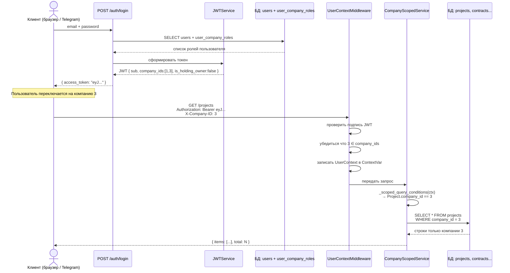
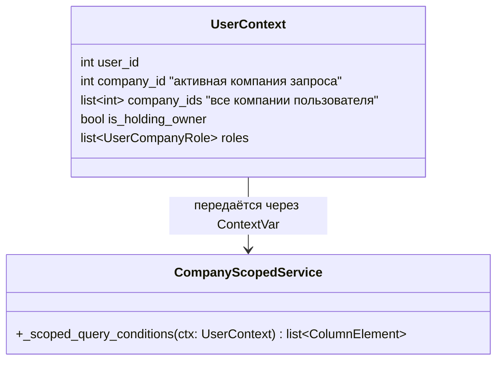
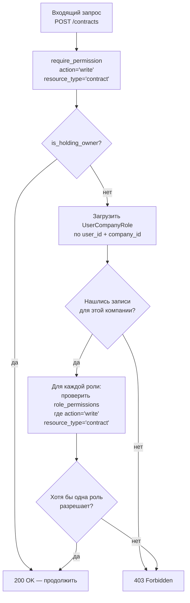
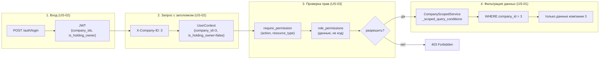

# M-OS-1.1A — Архитектурные диаграммы Sprint 1

> **Тип документа**: Reference + Explanation (Diátaxis)
> **Дата**: 2026-04-19
> **Статус**: живая документация — отражает состояние кода Sprint 1 (в разработке)
> **Связанные документы**:
> - `docs/adr/0011-foundation-multi-company-rbac-audit.md` — первоисточник архитектурных решений
> - `docs/pods/cottage-platform/phases/m-os-1-1a-decomposition-2026-04-18.md` — декомпозиция US-01/02/03

---

## Что здесь описано

Sprint 1 закладывает три фундаментальные части системы: многокомпанийная модель данных, JWT-авторизация с переключением компаний и тонко настраиваемый контроль доступа (RBAC). Все три части взаимозависимы: RBAC опирается на компанию из JWT, а JWT строится на данных модели. Диаграммы ниже показывают структуру и поведение системы.

---

## 1. Многокомпанийная модель данных (US-01)

> **Explanation** — что именно добавляется к базе данных и почему

Холдинг Мартина включает несколько юридических лиц. Сотрудник одного юрлица не должен видеть данные другого. Решение: каждая деловая сущность получает поле `company_id`, и все запросы автоматически фильтруются по нему.

### Таблицы с company_id

```mermaid
erDiagram
    companies {
        int id PK
        string inn "nullable"
        string full_name
        string short_name
        enum company_type "ООО, АО, ИП, ДРУГОЕ"
        bool is_active
        timestamptz created_at
    }

    users {
        int id PK
        string email
        string password_hash
        string full_name
        bool is_active
    }

    user_company_roles {
        int id PK
        int user_id FK
        int company_id FK
        enum role_template "owner, accountant, construction_manager, read_only"
        string pod_id "nullable — ограничение по поду"
        timestamptz granted_at
        int granted_by FK
    }

    projects {
        int id PK
        int company_id FK
        string code
        string name
        enum status
    }

    contracts {
        int id PK
        int company_id FK
        int project_id FK
        string number
        int amount_cents
        enum status
        int file_id "nullable — заглушка до M-OS-2"
        date start_date "nullable"
        date end_date "nullable"
        bool is_internal
        int counterparty_company_id FK "nullable"
    }

    payments {
        int id PK
        int company_id FK "денормализовано из Contract"
        int contract_id FK
        int amount_cents
        enum status
    }

    contractors {
        int id PK
        int company_id FK
        string name
    }

    houses {
        int id PK
        int company_id FK
    }

    stages {
        int id PK
        int company_id FK
    }

    materials {
        int id PK
        int company_id FK
    }

    budgets {
        int id PK
        int company_id FK
    }

    house_configurations {
        int id PK
        int company_id FK
    }

    role_permissions {
        int id PK
        enum role_template
        string action "read, write, approve, delete, admin"
        string resource_type "contract, payment, project, *"
        string pod_id "nullable"
        bool is_allowed
    }

    audit_log {
        int id PK
        int user_id FK
        string action
        string entity_type
        int entity_id
        jsonb changes_json
        string prev_hash "nullable — SHA-256 предыдущей записи"
        string hash "SHA-256 текущей записи"
        timestamptz timestamp
    }

    companies ||--o{ user_company_roles : "юрлицо — сотрудники"
    users ||--o{ user_company_roles : "сотрудник — роли"
    companies ||--o{ projects : "company_id"
    companies ||--o{ contracts : "company_id"
    companies ||--o{ payments : "company_id"
    companies ||--o{ contractors : "company_id"
    companies ||--o{ houses : "company_id"
    companies ||--o{ stages : "company_id"
    companies ||--o{ materials : "company_id"
    companies ||--o{ budgets : "company_id"
    companies ||--o{ house_configurations : "company_id"
```



> **Примечание**: `payments.company_id` денормализован — копируется из `contracts.company_id` при создании платежа (в сервисном слое, не триггером). Это ускоряет фильтрацию: не нужен JOIN с `contracts` при каждом запросе платежей.

> **Примечание**: диаграмма показывает 12 ключевых таблиц. Фактическое число таблиц без `company_id` выясняется исполнителями US-01 при анализе `backend/app/models/`.

---

## 2. JWT-авторизация и X-Company-ID (US-02)

> **Reference** — описание потока данных, шаг за шагом

Пользователь получает токен при входе. Токен содержит список компаний пользователя. При каждом запросе клиент указывает, с какой компанией работает — через заголовок `X-Company-ID`.

### Поток: от входа до запроса к базе данных



### Ключевые правила потока

| Ситуация | Что происходит |
|----------|---------------|
| У пользователя одна компания, заголовок не передан | Middleware берёт единственную компанию из `company_ids` |
| У пользователя несколько компаний, заголовок не передан | 400 Bad Request, код `COMPANY_ID_REQUIRED` |
| `X-Company-ID` указан, но не входит в `company_ids` токена | 403 Forbidden |
| `is_holding_owner: true` | Фильтр по `company_id` не применяется — видны все компании |

### Структура ContextVar



---

## 3. RBAC: проверка прав на эндпоинте (US-03)

> **Reference** — как работает проверка прав, от запроса до разрешения или отказа

Каждый эндпоинт, изменяющий данные (POST, PATCH, DELETE), защищён декоратором `require_permission`. Он проверяет не просто роль пользователя, а конкретное действие над конкретным типом ресурса в конкретной компании.

### Поток проверки прав



### Матрица прав (начальный seed)

Матрица хранится в таблице `role_permissions` — это данные, не код. Чтобы изменить права роли, достаточно обновить строку в таблице; деплой не нужен.

| Роль | contract.read | contract.write | payment.read | payment.write | payment.approve |
|------|:---:|:---:|:---:|:---:|:---:|
| owner | + | + | + | + | + |
| accountant | + | + | + | + | - |
| construction_manager | + | - | + | - | - |
| read_only | - | - | + | - | - |

Seed содержит минимум 4 роли × 5 действий = 20 строк (требование US-03).

### Декоратор: было и стало

```python
# Было (до Sprint 1) — устаревший стиль, в новом коде запрещён:
@require_role(UserRole.OWNER, UserRole.ACCOUNTANT)
async def create_contract(...):
    ...

# Стало (Sprint 1+) — единственный допустимый стиль:
@require_permission(action="write", resource_type="contract")
async def create_contract(...):
    ...
```

`require_role` сохранён как deprecated-alias — существующие тесты не ломаются. Удаляется в M-OS-1.3.

---

## 4. Как три части работают вместе



---

*Документ создан tech-writer. Источник истины — ADR 0011 и декомпозиция m-os-1-1a. При расхождении диаграмм с кодом — эскалировать к Координатору.*
